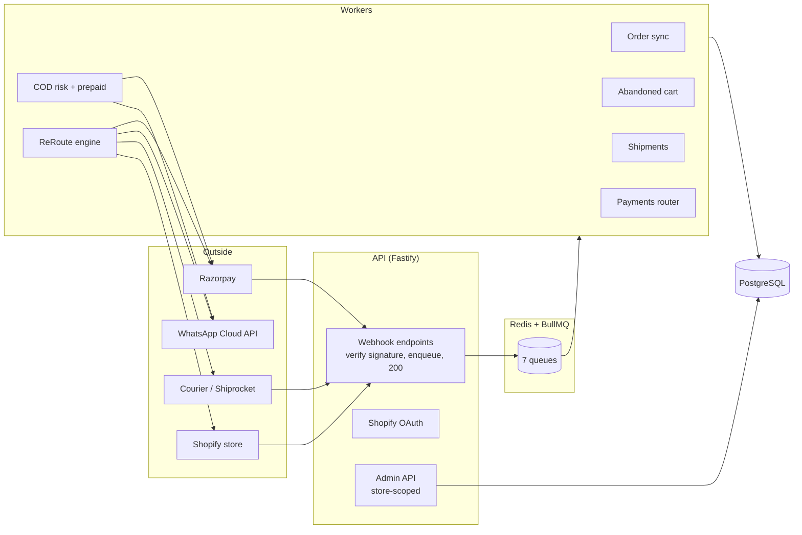
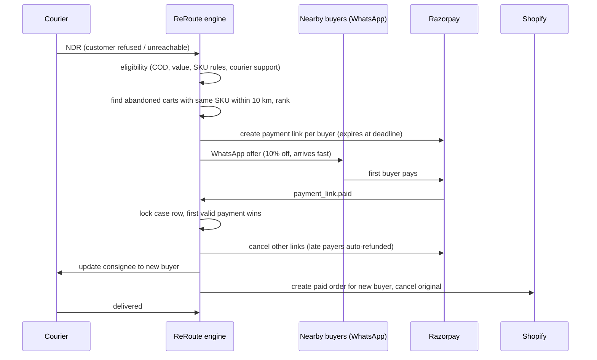

# Architecture

## One-line summary
A multi-tenant, event-driven backend. Every outside signal (Shopify, courier, Razorpay) arrives as a
signed webhook, is acknowledged in milliseconds, and is processed by idempotent background workers.

## System view

## Folder map

| Path | What lives there |
|---|---|
| `src/api` | HTTP server, routes, auth. Thin: validate → enqueue or query. |
| `src/workers` | One BullMQ worker per queue; maps jobs to module functions. |
| `src/modules/*` | Business logic. Each module owns its tables and exposes plain functions. |
| `src/integrations/*` | Clients for Shopify, Razorpay, WhatsApp, couriers. Only place that calls the outside world. |
| `src/db` | Drizzle schema, generated SQL migrations, migrator. |
| `src/lib` | Cross-cutting: env, logging, crypto, money, phone, geo, http retries, metrics, queues. |
| `tests` | Unit tests (pure logic) + one end-to-end integration test against real Postgres. |

## Queues

| Queue | Producer | Consumer | Dedupe key |
|---|---|---|---|
| `shopify.webhook` | `/webhooks/shopify` | order sync, cart, privacy | `x-shopify-webhook-id` |
| `cod.evaluate` | order sync (new COD order) | COD risk + prepaid offer | order id |
| `cart.nudge` | checkout upsert (delayed 1h / 24h) | abandoned cart | checkout id + attempt |
| `courier.event` | `/webhooks/courier/:courier` | shipments | tracking event dedupe key (DB) |
| `reroute.evaluate` | first NDR on a shipment | ReRoute engine | shipment id |
| `reroute.expire` | ReRoute offer sent (delayed TTL) | ReRoute engine | case id |
| `payment.event` | `/webhooks/razorpay` | payments router | `x-razorpay-event-id` |

## ReRoute: the core flow

### Correctness guarantees
- **Exactly one winner.** `handleOfferPaid` takes `SELECT ... FOR UPDATE` on the offer and the case.
  Any payment that arrives after the case is claimed is refunded.
- **Resumable completion.** `completeCase` checks each step (`shipment.status`, `newOrderExternalId`,
  `order.status`) before doing it, so a crash mid-way is safely resumed by the job retry.
- **Idempotent everywhere.** Webhooks are deduped twice: by BullMQ `jobId` and by DB unique keys
  (`webhook_receipts`, `tracking_events.dedupe_key`, one case per shipment, one conversion per order).
- **Out-of-order safe.** Orders keep the platform's `updated_at`; older webhooks are ignored.
  Terminal shipment states are never overwritten by late events.
- **Money is integer paise.** Never floats.

## COD risk model
`src/modules/cod-prepaid/risk.ts` is a transparent, rules-based score (0–100) with human-readable reasons
stored on each order. Inputs: customer delivered/RTO history, Bayesian-smoothed pincode RTO rate,
order value, phone validity, address quality, quantity, time of day. Every delivered/RTO outcome updates
`customers` and `pincode_stats`, so the model gets sharper per store over time. When you have enough
labelled outcomes, train an ML model on the same features and keep the rules as a fallback.

## Multi-tenancy and security
- Every table carries `store_id`; every admin query is scoped by `:storeId` in the URL.
- Shopify access tokens are encrypted at rest with AES-256-GCM (`ENCRYPTION_KEY`).
- All webhooks verify signatures on the **raw** body with constant-time comparison.
- Logs redact tokens, phones, emails and address lines; admin API masks customer names.
- Right to erasure: Shopify `customers/redact` and `shop/redact` are handled (`modules/privacy`).

## Scaling path
1. **Now:** one API container + one worker container + managed Postgres + managed Redis (ECS or a single VM).
2. **10k orders/day:** scale workers horizontally (BullMQ is safe for many consumers); add read replica for the dashboard.
3. **100k+ orders/day:** split queues across dedicated worker pools; move geo search to PostGIS; partition
   `tracking_events` and `audit_log` by month; move to Kubernetes with HPA on queue depth.
